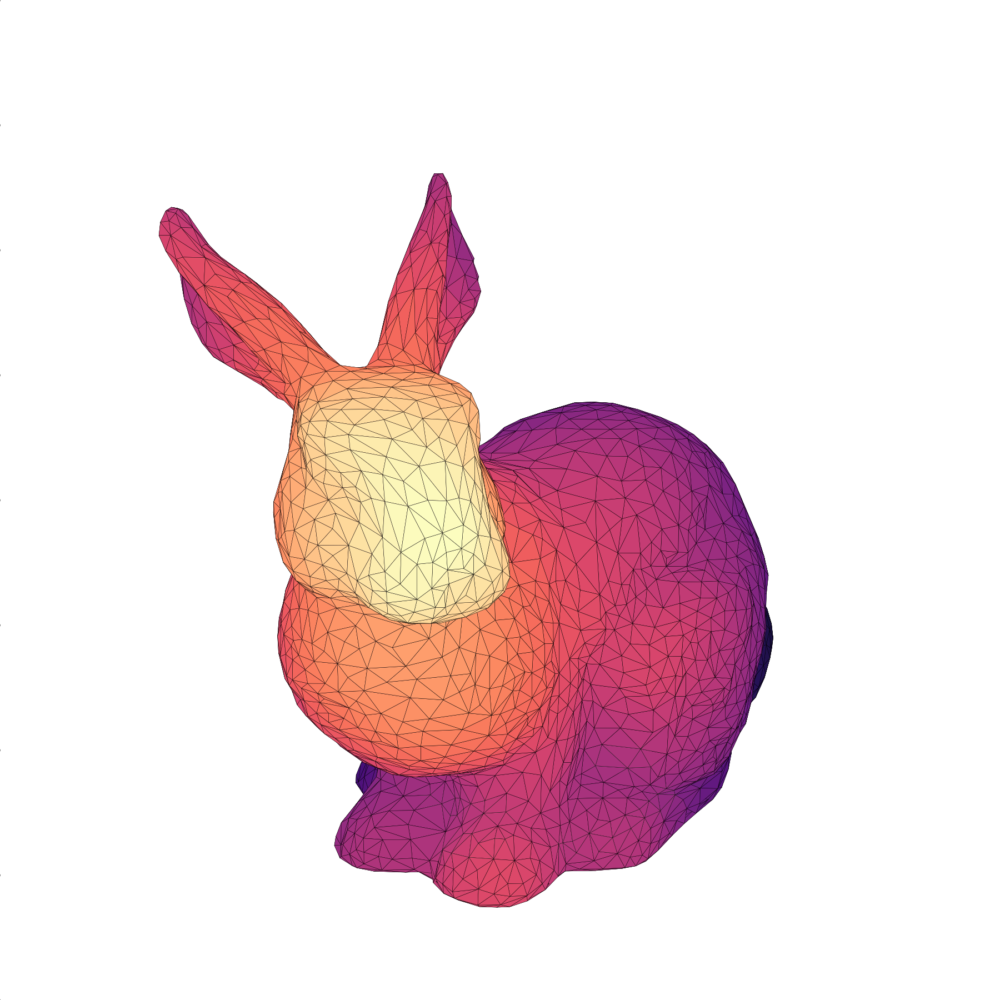

<div id="top"></div>
<div align="center">

[](https://creativecommons.org/licenses/by-sa/4.0/)
[![License: MIT][license1-shield]](https://github.com/goddamnparticle/esogu_toyds/blob/master/LICENSE-MIT.txt)

</div>

<!-- PROJECT LOGO -->
<br />
<div align="center">

  <a href="https://web.ogu.edu.tr/mlcv">
    
  </a>
  <h3 align="center">ESOGU Toy Point Cloud Dataset</h3>

  <p align="center">
    A toy dataset, for testing various deep learning methods on point clouds. 
    <br />
  </p>
</div>

<!-- ABOUT THE PROJECT -->



This repo provides a toy dataset collected by EEE undergraduate students of [Eskisehir Osmangazi University](https://ogu.edu.tr) with implementation of [PointNet++](https://arxiv.org/abs/1706.02413). Dataset consists of 10 different object classes and each class contains 10 different 3D objects. Objects were saved as ASCII coded `.ply` files. 3D objects were obtained with third-party photogrammetry software ([Meshroom](https://alicevision.org/#meshroom), [Agisoft](https://agisoft.com)). Also, for cleaning and editing tasks [MeshLab](https://meshlab.net) was utilized.

<!-- GETTING STARTED -->
## Getting Started

[Download](https://drive.google.com/uc?export=download&id=1_98r2c75YWbcJ9YK3JJ3Oe_IvYgn5RY5&confirm=t) dataset and extract to `data` folder this also can be done with `download_data.sh` script for Linux users. Folder structure should be as follows.  

            dataset/
            ├── train/
            │   ├── class_a/
            │   │   ├── xxy.ply
            │   │   ├── xxz.ply
            │   │   └── ...
            │   ├── class_b/
            │   │   ├── abc.ply
            │   │   ├── 12x.ply
            │   │   └── ...
            │    ...   
            │
            └── test/
                ├── class_a/
                │   ├── xay.ply
                │   ├── x2kz.ply
                │   └── ...
                ├── class_b/
                │   ├── c.ply
                │   ├── 12x.ply
                │   └── ...
                 ...   

To create a point cloud dataset `.ply` object files require sampling. `sample.py` will sample and save each file as binary. This process can be configured with `config.json`. A sampled binary dataset is available for [download](https://drive.google.com/uc?export=download&id=1WisS_DvtqVD4T3mxI2UcsxplMjLLy6eW&confirm=t). 

**NOTE**: Running `sample.py` will replace`.ply` files with binary `.npy` ones.

This Colab notebook trains a PointNet++ model. Notebook only works with the sampled binary dataset because of high computation costs. 

[](https://colab.research.google.com/github/goddamnparticle/esogu_toyds/blob/master/train_notebook.ipynb)


## Prerequisites

There are no specific version necessities for following `pip` packages. Regular installation will be sufficient.
* `torch`
* `torchvision`
* `tqdm`

A GPU highly recommended for training PointNet++. 


## Installation
1. Clone the repo

   ```sh
   git clone https://github.com/goddamnparticle/esogu_toyds
   ```
2. Download dataset either manually or with `download_data.sh` script.

3. Install python packages. A virtual environment is recommended.

   ```sh
   pip install torch torchvision tqdm
   ```
<!-- USAGE -->
## Sampling Dataset and Training PointNet++
Sampling and training processes have common configuration file `config.json`. Sample dataset with 
```sh
python sample.py
```

A PointNet++ model can be trained with 
```sh 
python train.py 
```

<!-- ROADMAP -->

## Roadmap

- [x] Create repo without dataset.
- [x] Add dataset.
- [ ] Add additional samples.
- [ ] Add training results.


<!-- CONTRIBUTING -->
## Contributing

If you have a suggestion that would make sampling and training faster, please fork the repo and create a pull request. You can also simply open an issue with the tag "enhancement".

1. Fork the Repo
2. Create your Branch (`git checkout -b jitted_sampling/BlazinglyFast`)
3. Commit your Changes (`git commit -m 'Faster sampling BlazinglyFast'`)
4. Push to the Branch (`git push origin jitted_sampling/BlazinglyFast`)
5. Open a Pull Request


<!-- LICENSE -->
## License

Dataset distributed under CC-BY-4.0 License and other stuff distributed under the MIT License. See `LICENSE_CC-BY-4.0.txt` and `LICENSE-MIT.txt` for more information.

<!-- ACKNOWLEDGMENTS -->
## Acknowledgments

PointNet++ pytorch implementation
* https://github.com/yanx27/Pointnet_Pointnet2_pytorch

Sampling and Visualistaions
* https://www.kaggle.com/code/balraj98/pointnet-for-3d-object-classification-ii-pytorch

PointNet implementation
* https://github.com/charlesq34/pointnet


<!-- MARKDOWN LINKS & IMAGES -->
<!-- https://www.markdownguide.org/basic-syntax/#reference-style-links -->
[contributors-shield]: https://img.shields.io/github/contributors/othneildrew/Best-README-Template.svg?style=for-the-badge
[contributors-url]: https://github.com/othneildrew/Best-README-Template/graphs/contributors
[forks-shield]: https://img.shields.io/github/forks/othneildrew/Best-README-Template.svg?style=for-the-badge
[forks-url]: https://github.com/othneildrew/Best-README-Template/network/members
[stars-shield]: https://img.shields.io/github/stars/othneildrew/Best-README-Template.svg?style=for-the-badge
[stars-url]: https://github.com/othneildrew/Best-README-Template/stargazers
[issues-shield]: https://img.shields.io/github/issues/othneildrew/Best-README-Template.svg?style=for-the-badge
[issues-url]: https://github.com/othneildrew/Best-README-Template/issues
[license1-shield]: https://img.shields.io/github/license/othneildrew/Best-README-Template.svg?style=for-the-badge
[license1-url]: https://github.com/othneildrew/Best-README-Template/blob/master/LICENSE.txt
[license2-shiled]: https://img.shields.io/badge/License-CC_BY_4.0-lightgrey.svg
[license2-url]: https://creativecommons.org/licenses/by/4.0/
[linkedin-shield]: https://img.shields.io/badge/-LinkedIn-black.svg?style=for-the-badge&logo=linkedin&colorB=555
